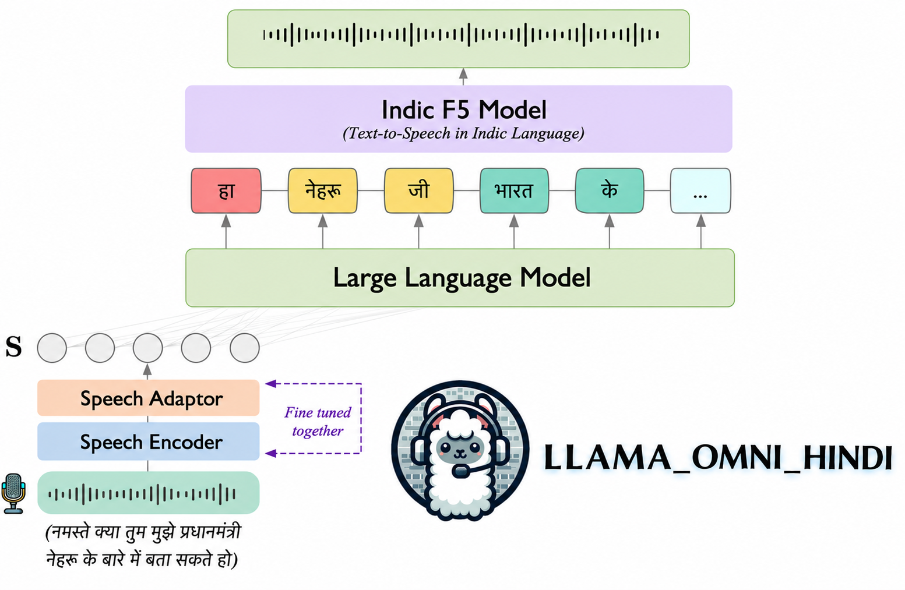

# Hindi LLaMA-Omni

> A LLaMA-Omni inspired end-to-end speech language model fine-tuned for Hindi, capable of understanding spoken Hindi questions and responding in speech — in your own voice.



---

## Overview

This project adapts the [LLaMA-Omni](https://github.com/ictnlp/LLaMA-Omni) architecture for the Hindi language. LLaMA-Omni is an end-to-end speech interaction model that enables generation of text and speech responses from speech input, targeting voice assistants.

### Key differences from the original LLaMA-Omni

| | Original LLaMA-Omni | This Work |
|---|---|---|
| Language | English | **Hindi** |
| Training stages | 2-stage | **1-stage** (simplified) |
| Training pipeline | Not open-sourced | **Added in this repo** |
| Vocoder | HiFi-GAN (English only) | **IndicF5 (Hindi TTS, voice cloning)** |
| Dataset | English InstructS2S | **Custom Hindi dataset (generated)** |

---

## Architecture

The model follows the LLaMA-Omni pipeline:

1. **Speech Encoder** — OpenAI Whisper encoder extracts acoustic features from the input speech. The encoder is **frozen** during training.
2. **Speech Projector (Adaptor)** — A lightweight adapter maps Whisper embeddings into the LLM's token space. **Fine-tuned** end-to-end.
3. **LLaMA 3B** — The backbone language model, already pre-trained on multilingual data including Hindi, so it natively has Hindi vocabulary tokens. **Fine-tuned** together with the projector.
4. **IndicF5 TTS (voice cloning)** — Instead of the original English-only HiFi-GAN vocoder, the generated Hindi text is fed into [IndicF5](https://github.com/AI4Bharat/IndicF5), a high-quality polyglot TTS model supporting 11 Indian languages. IndicF5's voice cloning feature is used so the model responds in a cloned personal voice.

### Training

The original LLaMA-Omni used a two-stage training process. Here, this has been simplified to a **single training stage** where the speech projector and the LLaMA 3B backbone are jointly fine-tuned on the Hindi instruction dataset. The Whisper encoder remains frozen throughout.

Since LLaMA 3B was pre-trained on multilingual corpora including Hindi, it already has the necessary Hindi subword tokens — no vocabulary extension was needed.

---

## Dataset

No suitable Hindi spoken instruction-following dataset existed, so a custom one was created from scratch.

- **Base text data**: Built upon the [Indic dataset](https://huggingface.co/datasets/ai4bharat/indic_instruct_data) (instruction-following pairs in Hindi)
- **Audio generation**: Hindi question audio was synthesized using [Facebook's MMS-TTS](https://huggingface.co/facebook/mms-tts) (Massively Multilingual Speech) model
- **Format**: Each sample contains a Hindi spoken question (FLAC audio) paired with a Hindi text response
- **Size**: ~110k samples

The dataset is publicly available on Hugging Face:
**[Pastaaaaa2003/hindi-llama-omni](https://huggingface.co/datasets/Pastaaaaa2003/Hindi-speech-instruct)**

---

## Training Pipeline

The original LLaMA-Omni repository did not include training code. This repo adds a full training pipeline built with PyTorch Lightning, including:

- `omni_speech/trainer.py` — training loop with mixed-precision, gradient accumulation, checkpointing
- `omni_speech/datasets/preprocess.py` — data preprocessing and mel spectrogram extraction
- `config.yaml` — unified config for data paths, model, and training hyperparameters
- `train_slurm.sh` — SLURM job script for cluster training

---

## Voice Cloning with IndicF5

The original vocoder (HiFi-GAN) was trained exclusively on English speech and produces unnatural output for Hindi. It has been replaced entirely by **[IndicF5](https://github.com/AI4Bharat/IndicF5)**, a near-human quality TTS model trained on 1417 hours of speech across 11 Indian languages including Hindi.

IndicF5 supports zero-shot voice cloning via a reference audio prompt, which means the model can be made to speak back in any target voice — including your own — simply by providing a short reference clip at inference time.

---

## Installation

### 1. Clone the repository

```bash
git clone https://github.com/Asthag29/omni_slm.git
cd omni_slm
```

### 2. Create conda environment

```bash
conda create -n hindi-llama-omni python=3.10 -y
conda activate hindi-llama-omni
```

### 3. Install dependencies

```bash
pip install -e ".[train]"
```

Install Flash Attention (required for efficient attention):

```bash
pip install flash-attn==2.5.8 --no-build-isolation
```

Install IndicF5 for Hindi TTS / voice cloning:

```bash
pip install git+https://github.com/AI4Bharat/IndicF5.git
```

### 4. Download models

The training and inference configs expect the LLaMA-Omni checkpoint at `models/llama`.
That checkpoint config uses the Whisper encoder `large-v3`.

Install the Hugging Face CLI if needed:

```bash
curl -LsSf https://hf.co/cli/install.sh | bash -s
hf auth login
```

Download the LLaMA-Omni model used by this repo:

```bash
mkdir -p models/llama
hf download ICTNLP/Llama-3.1-8B-Omni \
  --local-dir models/llama \
  --type model
```

Download or pre-cache the Whisper Large v3 encoder weights:

```bash
python - <<'PY'
import whisper

whisper.load_model("large-v3", download_root="models/speech_encoder")
PY
```

The repo only uses the Whisper encoder part. The active config value is stored in
`models/llama/config.json` as `speech_encoder: "large-v3"`.

---

## Inference

```bash
python speech_generation.py \
    --input-audio path/to/question.flac \
    --ref-audio path/to/your_voice_sample.wav \
    --ref-text "Reference transcript of the voice sample"
```

The model will:
1. Encode the input speech with Whisper
2. Generate a Hindi text response with LLaMA 3B
3. Synthesize the response audio with IndicF5 in the cloned voice

---

## Training

Edit `config.yaml` to set your data path and model paths, then run:

```bash
python -m omni_speech.train
```

---

## Credits

- [LLaMA-Omni](https://github.com/ictnlp/LLaMA-Omni) — original architecture
- [IndicF5 (AI4Bharat)](https://github.com/AI4Bharat/IndicF5) — Hindi TTS and voice cloning
- [Facebook MMS](https://huggingface.co/facebook/mms-tts) — audio generation for the training dataset
- [AI4Bharat Indic data](https://huggingface.co/datasets/ai4bharat/indic_instruct_data) — base instruction data

---

## License

Apache 2.0
