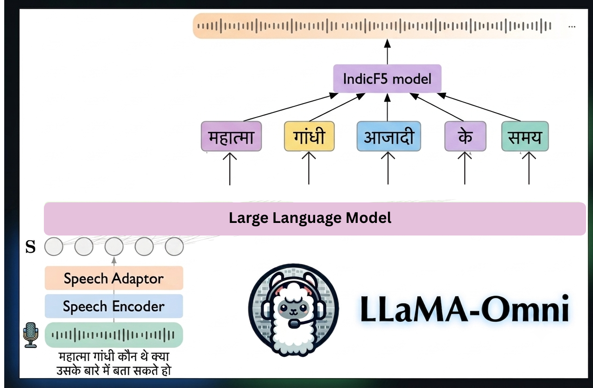

# 🦙🎧 Hindi LLaMA-Omni: Hindi Speech Interaction with Large Language Models

> Hindi LLaMA-Omni is a Hindi speech-language model built upon [LLaMA-Omni](https://github.com/ictnlp/LLaMA-Omni). It uses Whisper for speech understanding, a fine-tuned Hindi LLaMA-Omni backbone for response generation, and IndicF5 for voice-cloned Hindi speech output.

[](https://huggingface.co/Pastaaaaa2003/hindi-llama-omni-model)
[](https://huggingface.co/datasets/Pastaaaaa2003/Hindi-speech-instruct)
[](https://github.com/ictnlp/LLaMA-Omni)
[](https://github.com/AI4Bharat/IndicF5)




- 🗣️ **Hindi speech interaction:** accepts Hindi speech questions and returns Hindi speech answers.
- 🧠 **Built on LLaMA-Omni:** keeps the Whisper encoder and speech projector structure from the original speech-language architecture.
- 🇮🇳 **Fine-tuned for Hindi instruction following:** trained with Hindi instruction data converted into speech-question form.
- 🎙️ **IndicF5 speech generation:** replaces the original unit-vocoder output path with IndicF5 voice-cloned synthesis.
- 📊 **Evaluated in Hindi:** includes IndicQA, MT-Bench-Hi, IFEval-Hi, and GSM8K-Hi evaluation scripts.

## 💡 Architecture

The runtime flow is:

1. A user records or uploads a Hindi speech question.
2. Whisper encodes the speech input.
3. The speech projector maps audio features into the LLaMA-Omni language backbone.
4. The fine-tuned Hindi backbone generates a Hindi text response.
5. The same user audio is used as a reference for IndicF5 speech generator.
6. IndicF5 synthesizes the final answer in the user's reference voice.

## 📚 Data

This project uses Hindi instruction-following examples converted into speech-question form. Since public datasets with Hindi speech questions paired with text answers do not exist, the training data was generated from Hindi instruction corpora and converted into audio for speech-instruction fine-tuning.

Dataset card: [`Pastaaaaa2003/Hindi-speech-instruct`](https://huggingface.co/datasets/Pastaaaaa2003/Hindi-speech-instruct)

The text instruction mixture includes AI4Bharat Indic-Instruct style sources such as `anudesh`, `flan_v2`, `hh-rlhf`, and `lm_sys`.

## 🛠️ Install

#### 1. Clone This Repository

```bash
git clone https://github.com/Asthag29/llama_omni_hindi_.git
cd llama_omni_hindi_
```

#### 2. Create Environment

Create and activate a Python `3.11.14` environment.

```bash
uv venv .venv --python 3.11.14
source .venv/bin/activate
```

#### 3. Install PyTorch

Install the CUDA 12.1 PyTorch wheels.

```bash
uv pip install torch==2.1.2+cu121 torchvision==0.16.2+cu121 torchaudio==2.1.2+cu121 \
  --index-url https://download.pytorch.org/whl/cu121
```

#### 4. Install Project Requirements

Install the Python dependencies used by this repo.

```bash
uv pip install -r requirements.txt
```

For development, you can also install the repo in editable mode.

```bash
uv pip install -e .
```

#### 5. Install IndicF5

Install IndicF5 separately, since it is managed as an external speech-generation dependency.

```bash
uv pip install --python ./.venv/bin/python "f5_tts @ git+https://github.com/AI4Bharat/IndicF5.git"
```

## ⚡ Quick Start

Download the LLaMA-Omni checkpoint:

```bash
mkdir -p models/llama
hf download ICTNLP/Llama-3.1-8B-Omni \
  --local-dir models/llama \
  --type model
```

Download the Whisper `large-v3` encoder weights:

```bash
python omni_speech/datasets/downloader/whisper_downloader.py
```

Download the IndicF5 model snapshot:

```bash
python omni_speech/datasets/downloader/indicf5_downloader.py
```

Expected local model layout:

```text
models/
├── llama/            # LLaMA-Omni checkpoint
├── speech_encoder/   # Whisper large-v3 weights
└── indicf5/          # IndicF5 model snapshot
```

## 🎧 Gradio Demo

Launch the controller:

```bash
python -m omni_speech.serve.controller --host 0.0.0.0 --port 21001
```

Launch the model worker:

```bash
python -m omni_speech.serve.model_worker \
  --host 0.0.0.0 \
  --port 21002 \
  --worker-address http://localhost:21002 \
  --controller-address http://localhost:21001 \
  --model-path models/llama \
  --model-name llama-omni-hindi
```

Launch the Gradio web server:

```bash
python -m omni_speech.serve.gradio_web_server \
  --host 0.0.0.0 \
  --port 7860 \
  --controller-url http://localhost:21001
```

Then open <http://localhost:7860/> and interact with Hindi LLaMA-Omni.

## 📊 Evaluation

Evaluation scripts live in `evaluations/`, and the full results discussion is maintained in [`evaluations/results/summary.md`](evaluations/results/summary.md).

Run the evaluations from an activated environment:

```bash
python evaluations/indicQA.py
python evaluations/mt_bench_hi.py
python evaluations/if_eval_hi.py
python evaluations/gsm8k_hi.py
```

The scripts write result files under `evaluations/results/`.

### Summary

Across the available evaluations, the fine-tuned model improves Hindi QA, answer overlap, semantic similarity, extraction, STEM, humanities, writing, and instruction-following metrics. These gains align with the Hindi instruction data used for training, which emphasizes direct question answering, transformation, extraction, formatting, and concise assistant responses.


## 🙏 Acknowledgements

- [LLaMA-Omni](https://github.com/ictnlp/LLaMA-Omni): base speech-language architecture and code structure.
- [Whisper](https://github.com/openai/whisper): speech encoder used for spoken input and reference transcription.
- [IndicF5](https://github.com/AI4Bharat/IndicF5): Hindi/Indic voice-cloned speech generation backend.
- [AI4Bharat](https://ai4bharat.iitm.ac.in/): Indic instruction and speech resources.


