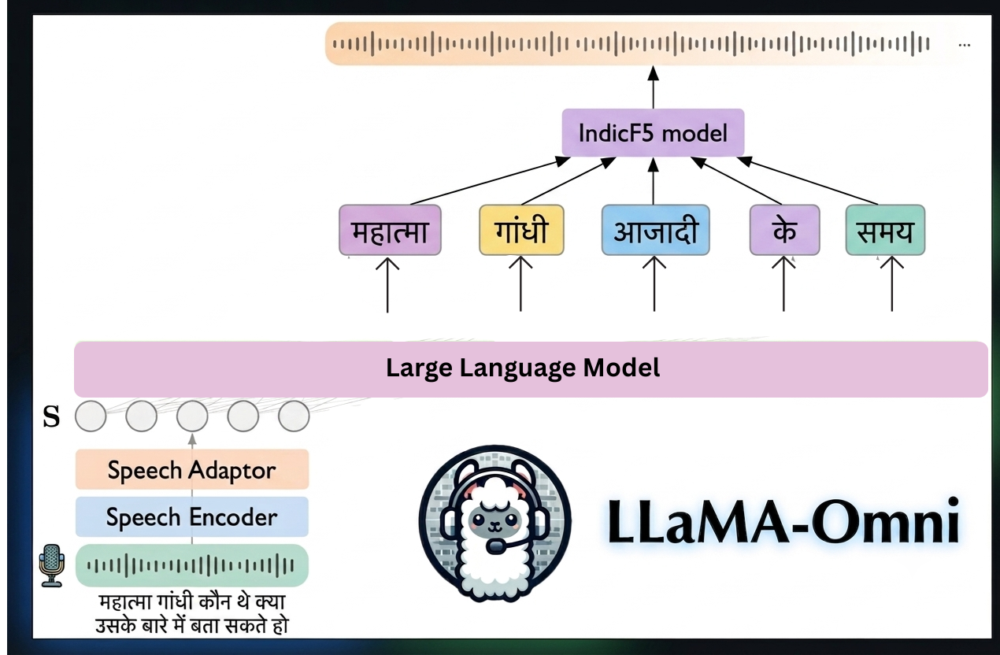

# 🦙🎧 Hindi LLaMA-Omni: Hindi Speech Interaction with Large Language Models

> Hindi LLaMA-Omni is a Hindi speech-language model built upon [LLaMA-Omni](https://github.com/ictnlp/LLaMA-Omni). It uses Whisper for speech understanding, a fine-tuned Hindi LLaMA-Omni backbone for response generation, and IndicF5 for voice-cloned Hindi speech output.

[](https://huggingface.co/Pastaaaaa2003/hindi-llama-omni-model)
[](https://huggingface.co/datasets/Pastaaaaa2003/Hindi-speech-instruct)
[](https://github.com/ictnlp/LLaMA-Omni)
[](https://github.com/AI4Bharat/IndicF5)




- 🗣️ **Hindi speech interaction:** accepts Hindi speech questions and returns Hindi speech answers.
- 🧠 **Built on LLaMA-Omni:** keeps the Whisper encoder and speech projector structure from the original speech-language architecture.
- 🇮🇳 **Fine-tuned for Hindi instruction following:** trained with Hindi instruction data converted into speech-question form.
- 🎙️ **IndicF5 speech generation:** replaces the original unit-vocoder output path with IndicF5 voice-cloned synthesis.
- 📊 **Evaluated in Hindi:** includes IndicQA, MT-Bench-Hi, IFEval-Hi, and GSM8K-Hi evaluation scripts.

## 💡 Architecture

The runtime flow is:

1. A user records or uploads a Hindi speech question.
2. Whisper encodes the speech input.
3. The speech projector maps audio features into the LLaMA-Omni language backbone.
4. The fine-tuned Hindi backbone generates a Hindi text response.
5. The same user audio is used as a reference for IndicF5 speech generator.
6. IndicF5 synthesizes the final answer in the user's reference voice.

## 📚 Data

This project uses Hindi instruction-following examples converted into speech-question form. Since public datasets with Hindi speech questions paired with text answers do not exist, the training data was generated from Hindi instruction corpora and converted into audio for speech-instruction fine-tuning.

Dataset card: [`Pastaaaaa2003/Hindi-speech-instruct`](https://huggingface.co/datasets/Pastaaaaa2003/Hindi-speech-instruct)

The text instruction mixture includes AI4Bharat Indic-Instruct style sources such as `anudesh`, `flan_v2`, `hh-rlhf`, and `lm_sys`.

## ⚖️ License and attribution

The upstream LLaMA-Omni weights in this bundle are released for academic,
non-commercial use only. Follow the upstream [model terms](https://huggingface.co/ICTNLP/Llama-3.1-8B-Omni)
and cite the original [LLaMA-Omni paper](https://arxiv.org/abs/2409.06666).
The Hindi adapter is provided for research use with the same restriction.
IndicF5 and Whisper retain their respective upstream licenses.

## 🛠️ Install

The supported runtime is Linux with an NVIDIA GPU and CUDA 12.1. The complete
model bundle is approximately 20 GB, so keep at least 25 GB free disk space.
Apple Silicon is not currently a supported runtime for the Gradio server.

#### 1. Install prerequisites

Install Python 3.11.14, Git, and `uv`. For Linux, install a CUDA driver
compatible with CUDA 12.1.

```bash
curl -LsSf https://astral.sh/uv/install.sh | sh
```

#### 2. Clone this repository and create an environment

```bash
git clone https://github.com/Asthag29/llama_omni_hindi_.git
cd llama_omni_hindi_
```

```bash
uv venv .venv --python 3.11.14
source .venv/bin/activate
```

#### 3. Install dependencies

```bash
uv pip install torch==2.1.2+cu121 torchvision==0.16.2+cu121 torchaudio==2.1.2+cu121 \
  --index-url https://download.pytorch.org/whl/cu121
```

#### 4. Install project requirements

```bash
uv pip install -r requirements.txt
uv pip install -e .
uv pip install "f5_tts @ git+https://github.com/AI4Bharat/IndicF5.git"
```

## ⚡ Download the complete model bundle

The Hindi checkpoint and its required base models are published in one
Hugging Face repository. Download the bundle from the project root; do not
download it into `models/llama`, because the repository contains all required
subdirectories.

```bash
hf download Pastaaaaa2003/hindi-llama-omni-model \
  --repo-type model \
  --local-dir . \
  --exclude README.md images/*
```

The download is approximately 20 GB and may take several minutes. The
resulting layout must be:

```text
models/
├── llama/            # LLaMA-Omni base model
├── speech_encoder/   # Whisper large-v3 weights
├── indicf5/          # IndicF5 model snapshot
└── hindi_ckpt/
    ├── stage_1/      # Hindi stage-1 checkpoint
    └── stage_2/      # Hindi stage-2 checkpoint
        └── speech_text/
            └── checkpoints/
                └── last/  # adapter and speech projector
```

Check that the checkpoint is present:

```bash
test -f models/hindi_ckpt/stage_2/speech_text/checkpoints/last/adapter_model.safetensors
test -f models/hindi_ckpt/stage_2/speech_text/checkpoints/last/speech_projector.safetensors
```

## 🎧 Run the Gradio demo

Start each command in a separate terminal. Activate the environment and run
the commands from the repository root.

**Terminal 1 — controller**

```bash
source .venv/bin/activate
python -m omni_speech.serve.controller --host 127.0.0.1 --port 21001
```

**Terminal 2 — Hindi model worker**

```bash
source .venv/bin/activate
python -m omni_speech.serve.model_worker \
  --host 127.0.0.1 \
  --port 21002 \
  --worker-address http://127.0.0.1:21002 \
  --controller-address http://127.0.0.1:21001 \
  --model-path models/llama \
  --model-name llama-omni-hindi \
  --checkpoint models/hindi_ckpt/stage_2/speech_text/checkpoints/last \
  --config configs/stage_2.yaml \
  --device cuda
```

Wait until the worker reports that it has registered with the controller.

**Terminal 3 — web interface**

```bash
source .venv/bin/activate
python -m omni_speech.serve.gradio_web_server \
  --host 127.0.0.1 \
  --port 7860 \
  --controller-url http://127.0.0.1:21001 \
  --indicf5-model-path models/indicf5 \
  --reference-asr-download-root models/speech_encoder \
  --reference-language hi
```

Open <http://127.0.0.1:7860/> and record or upload a Hindi speech question.
The same audio is used as the reference voice for IndicF5 synthesis.

## 🧪 Text-only local inference

To test response generation without starting the web server:

```bash
python -m omni_speech.infer.inference \
  --audio path/to/hindi-question.wav \
  --checkpoint models/hindi_ckpt/stage_2/speech_text/checkpoints/last
```

## 📊 Evaluation

Evaluation scripts live in `evaluations/`, and the full results discussion is maintained in [`evaluations/results/summary.md`](evaluations/results/summary.md).

Run the evaluations from an activated environment:

```bash
python evaluations/indicQA.py
python evaluations/mt_bench_hi.py
python evaluations/if_eval_hi.py
python evaluations/gsm8k_hi.py
```

The scripts write result files under `evaluations/results/`.

### Summary

Across the available evaluations, the fine-tuned model improves Hindi QA, answer overlap, semantic similarity, extraction, STEM, humanities, writing, and instruction-following metrics. These gains align with the Hindi instruction data used for training, which emphasizes direct question answering, transformation, extraction, formatting, and concise assistant responses.


## 🙏 Acknowledgements

- [LLaMA-Omni](https://github.com/ictnlp/LLaMA-Omni): base speech-language architecture and code structure.
- [Whisper](https://github.com/openai/whisper): speech encoder used for spoken input and reference transcription.
- [IndicF5](https://github.com/AI4Bharat/IndicF5): Hindi/Indic voice-cloned speech generation backend.
- [AI4Bharat](https://ai4bharat.iitm.ac.in/): Indic instruction and speech resources.


