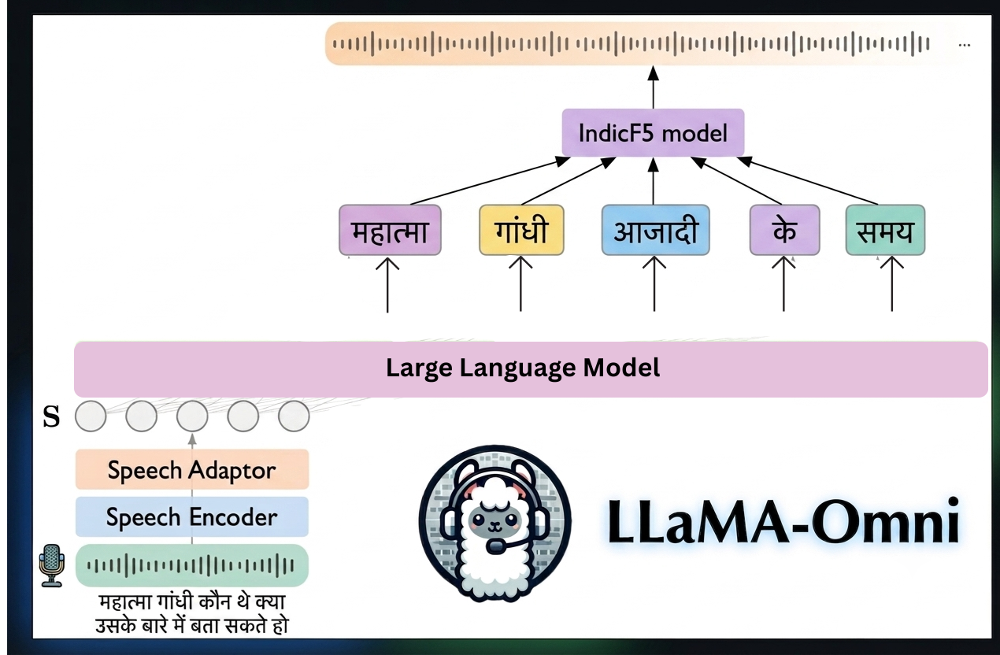

# 🦙🎧 Hindi LLaMA-Omni: Hindi Speech Interaction with Large Language Models

> Hindi LLaMA-Omni is a Hindi speech-to-speech model built upon [LLaMA-Omni](https://github.com/ictnlp/LLaMA-Omni). It uses Whisper for speech understanding, a LoRA-fine-tuned Hindi LLaMA-Omni backbone for response generation, and IndicF5 to synthesize answers in one fixed default Hindi voice.

[](https://huggingface.co/Pastaaaaa2003/hindi-llama-omni-model)
[](https://huggingface.co/datasets/Pastaaaaa2003/Hindi-speech-instruct)
[](https://github.com/ictnlp/LLaMA-Omni)
[](https://github.com/AI4Bharat/IndicF5)



- 🗣️ **Hindi speech interaction:** accepts Hindi speech questions and returns Hindi speech answers.
- 🧠 **Built on LLaMA-Omni:** keeps the Whisper encoder and speech projector structure from the original speech-language architecture.
- 🇮🇳 **Fine-tuned for Hindi instruction following:** two-stage LoRA training on Hindi instruction data converted into speech-question form.
- 🎙️ **IndicF5 speech generation:** replaces the original unit-vocoder output path with a fixed default Hindi voice.
- 📊 **Evaluated in Hindi:** IndicQA, MT-Bench-Hi, IFEval-Hi, and GSM8K-Hi scripts with published results.

## 💡 Architecture

The runtime flow is:

1. A user records or uploads a Hindi speech question.
2. Whisper large-v3 encodes the speech input (frozen).
3. The speech projector maps audio features into the LLaMA-Omni language backbone.
4. The Hindi-fine-tuned backbone (LoRA adapter) generates a Hindi text response.
5. A bundled reference recording provides the fixed speaker identity for IndicF5.
6. IndicF5 synthesizes the final answer in the fixed default voice.

## 🗂️ Repository layout

```text
omni_speech/
├── model/            # LLaMA-Omni architecture: speech encoder, projector, LLM
├── tts/              # IndicF5 speech-synthesis wrapper
├── training/         # stage1.py, stage2.py, combined.py (Hydra + PyTorch Lightning)
├── datasets/         # text-data downloader, preprocessing, train/validation/test split
├── infer/            # inference.py: speech in, Hindi text out
└── serve/            # controller, model_worker, gradio_web_server
configs/              # stage_1.yaml, stage_2.yaml, combined.yaml
evaluations/          # benchmark scripts and results/summary.md
tests/                # pytest suite
pyproject.toml        # dependencies (requirements.txt just installs the project)
check_models.py       # verifies every checkpoint file is present
data/inference.wav    # IndicF5 reference voice; also the default test question
data/splits/          # validation and test ids for the stage-1 text data
```

## 🛠️ Install

The supported runtime is Linux with an NVIDIA GPU (about 24 GB VRAM for
inference) and CUDA 12.1. Keep about 40 GB free disk space for the environment
and checkpoints. Apple Silicon is not a supported runtime for the Gradio server.

Python 3.11 is required. Dependencies are declared in `pyproject.toml`, with
two extras: `eval` (benchmark scripts) and `test` (pytest).

```bash
git clone https://github.com/Asthag29/llama_omni_hindi_.git
cd llama_omni_hindi_
```

**With [uv](https://docs.astral.sh/uv/)** (recommended; installs the exact
versions in `uv.lock`, including the CUDA 12.1 PyTorch build):

```bash
uv sync --extra eval --extra test
source .venv/bin/activate
```

**With pip**, install the CUDA 12.1 PyTorch build first, then the project:

```bash
python3.11 -m venv .venv
source .venv/bin/activate
python -m pip install --upgrade pip
pip install torch==2.1.2+cu121 torchaudio==2.1.2+cu121 \
  --index-url https://download.pytorch.org/whl/cu121
pip install -r requirements.txt    # same as: pip install -e ".[eval,test]"
```

Both install the project in editable mode, which the Hydra configs and example
audio rely on. `transformers` is pinned to `4.43.4` because LLaMA-Omni's model
code depends on it. Do not bump it; the "IndicF5 weights" note below explains
how the IndicF5 loader copes with that version.

## ⚡ Download model checkpoints

1. Download [`ICTNLP/Llama-3.1-8B-Omni`](https://huggingface.co/ICTNLP/Llama-3.1-8B-Omni) into `models/llama/`:

```bash
hf download ICTNLP/Llama-3.1-8B-Omni --local-dir models/llama
```

2. Download Whisper large-v3:

```python
import whisper
whisper.load_model("large-v3", download_root="models/speech_encoder/")
```

3. [IndicF5](https://huggingface.co/ai4bharat/IndicF5) is a gated repository.
   Request access on that page first, then download it:

```bash
hf download ai4bharat/IndicF5 --local-dir models/indicf5
```

4. Download this project's Hindi stage-2 adapter:

```bash
hf download Pastaaaaa2003/hindi-llama-omni-model --local-dir models/hindi
```

Then run the checkpoint check from the repository root. It confirms every
required file is present and that Whisper matches the official SHA-256:

```bash
python check_models.py
```

Do not start Gradio or `inference.py` until this check succeeds. The final
layout is:

```text
models/
├── llama/            # LLaMA-Omni base model (config, tokenizer, 4 safetensors shards)
├── speech_encoder/   # large-v3.pt
├── indicf5/          # IndicF5 snapshot (config.json, model.py, model.safetensors, checkpoints/vocab.txt)
└── hindi/            # adapter_config.json, adapter_model.safetensors, speech_projector.safetensors
```

Only the final stage-2 adapter is published. Stage-1 checkpoints are training
artifacts and are not required for inference.

#### IndicF5 weights

IndicF5 names its GRN and Vocos layer-scale parameters `gamma` / `beta`. The
pinned `transformers==4.43.4` rewrites those substrings to `weight` / `bias`
inside `from_pretrained`, so 16 tensors silently miss the model and keep their
random init. The loader therefore builds the model from its config and loads
`model.safetensors` with `load_state_dict(strict=True)` instead; every
checkpoint tensor lands, and `tests/test_indicf5.py` fails if that ever
regresses.

## 🎧 Run the Gradio demo

Start each command in a separate terminal from the repository root with the
environment activated.

**Terminal 1 — controller**

```bash
python -m omni_speech.serve.controller --host 127.0.0.1 --port 21001
```

**Terminal 2 — Hindi model worker**

```bash
python -m omni_speech.serve.model_worker \
  --host 127.0.0.1 \
  --port 21002 \
  --worker-address http://127.0.0.1:21002 \
  --controller-address http://127.0.0.1:21001 \
  --model-name llama-omni-hindi \
  --checkpoint models/hindi \
  --config configs/stage_2.yaml \
  --device cuda
```

Wait until the worker reports that it has registered with the controller. The
base model location (`models/llama`) is read from the config.

**Terminal 3 — web interface**

```bash
python -m omni_speech.serve.gradio_web_server \
  --host 127.0.0.1 \
  --port 7860 \
  --controller-url http://127.0.0.1:21001 \
  --indicf5-model-path models/indicf5
```

Open <http://127.0.0.1:7860/> and record or upload a Hindi speech question.
The demo returns a Hindi audio answer using `data/inference.wav` as the fixed
IndicF5 reference voice with its fixed transcript (the first lines of the poem
*तितली रानी*, set in `DEFAULT_REFERENCE_TEXT` in `gradio_web_server.py`);
Whisper is not used to transcribe reference audio. Add `--share` for a public
Gradio link, or `--indicf5-device cpu` to keep IndicF5 off the GPU.

## 🧪 Speech-input text-response test

This runs the speech-understanding and Hindi-text stages without the web
server and prints the Hindi response in the terminal. Use the Gradio demo for
the full speech-to-speech path.

```bash
python -m omni_speech.infer.inference \
  --audio path/to/hindi-question.wav \
  --checkpoint models/hindi
```

With no `--audio`, it uses the tracked `data/inference.wav`. Generation is
greedy by default; `--temperature`, `--top-p`, `--num-beams`, and
`--max-new-tokens` (default 256) are available.

## 🏋️ Training

Training is split into two stages because training the speech projector and
backbone together from the English instruction-tuned weights was unstable for
Hindi (large gradients, diverging loss). Stage 1 first adapts the backbone to
Hindi on text only; stage 2 then adds the speech projector.

| | Stage 1 | Stage 2 |
| --- | --- | --- |
| Entry point | `omni_speech.training.stage1` | `omni_speech.training.stage2` |
| Config | `configs/stage_1.yaml` | `configs/stage_2.yaml` |
| Trainable | LLM LoRA | LLM LoRA + speech projector |
| Frozen | Whisper, speech projector | Whisper |
| Input | Hindi text conversations (local JSON) | Hindi speech + text, streamed from the HF dataset |
| Init | `models/llama` | stage-1 `final_model` |
| Output | `outputs/stage_1/backbone_text/final_model/` | `outputs/stage_2/speech_text/final_model/` |

Shared hyperparameters (all in the YAML configs): LoRA `r=128`, `alpha=64`,
`dropout=0.05` on all attention and MLP projections; learning rate `1.07e-4`
with cosine schedule and 5% warmup; batch size 2 × 7 gradient-accumulation
steps; 3 epochs; `bf16-mixed`; gradient checkpointing; gradient clipping at
1.8. The published adapter was trained on a single H100: stage 1 ran its full
19,683 optimizer steps in about 11 hours (on an earlier random 90/10 split); stage 2 is the checkpoint at step
13,125 of a planned 22,500, where the job reached its 12-hour limit.

Both stages log to Weights & Biases by default (`logging.wandb: true`,
project `hindi_llama_omni`). Run `wandb login` first or pass
`logging.wandb=false`. Any config key can be overridden on the command line
with Hydra syntax, e.g. `training.devices=2`.

#### Stage 1: Hindi backbone on text

Stage 1 reads `data/instruct/hindi_instruct_conversations.json`, a JSON array
of `{"id": ..., "conversations": [{"from": "human", ...}, {"from": "gpt", ...}]}`
entries. To rebuild it from the
[`ai4bharat/indic-instruct-data-v0.1`](https://huggingface.co/datasets/ai4bharat/indic-instruct-data-v0.1)
Hindi splits (`anudesh`, `flan_v2`, `hh-rlhf`, `lm_sys`):

```bash
python -m omni_speech.datasets.downloader.hindi_text_downloader   # writes data/<split>_dataset.json; --splits picks a subset
# merge the splits you want into data/instruct/hindi_instruct.json, then:
python -m omni_speech.datasets.processing.format_hindi_instruct   # -> data/instruct/hindi_instruct_conversations.json
```

The data is split 80/10/10 into train, validation, and test within each of
the four sources (seed 42). The held-out ids are tracked in
`data/splits/validation_ids.txt` and `data/splits/test_ids.txt`; every other
sample is train. For the 102,055-sample file used here that is 81,643 /
10,206 / 10,206. Stage 1 prints the split per source at startup and stops if
the id lists are missing. To regenerate them after changing the data:

```bash
python -m omni_speech.datasets.processing.split_hindi_instruct          # rewrites data/splits/*.txt
python -m omni_speech.datasets.processing.split_hindi_instruct --write-json   # also train/validation/test .json files
```

Then train:

```bash
python -m omni_speech.training.stage1
```

The test split is never used during training; it is available through the
data module's `test_dataloader()` for a final `trainer.test` run.

#### Stage 2: speech projector + backbone

Stage 2 streams parquet shards directly from the
[`Pastaaaaa2003/Hindi-speech-instruct`](https://huggingface.co/datasets/Pastaaaaa2003/Hindi-speech-instruct)
dataset (105,000 train / 5,720 validation samples; see `streaming.*` in
`configs/stage_2.yaml`), so no local audio download is needed. Each row holds
the spoken question, its text, and the text answer; mel features (128 bins)
are computed on the fly. It initializes from the stage-1 adapter
(`model.init_checkpoint`).

```bash
python -m omni_speech.training.stage2
```

`final_model/` contains `adapter_config.json`, `adapter_model.safetensors`,
`speech_projector.safetensors`, and `checkpoint_meta.json`. Copy it to
`models/hindi/` to serve it.

#### Combined: local speech-text data

`omni_speech.training.combined` (`configs/combined.yaml`) trains the same
modules as stage 2 but from a local manifest instead of streaming:
`data/datasets.json` with `{"speech": "<file>.flac", "conversations": [...]}`
entries and audio under `data/flac/`. Use it when you have your own
speech-instruction data on disk.

## 📊 Evaluation

The scripts in `evaluations/` benchmark the Hindi **text** backbone: the base
LLaMA-Omni model (`--model base`), the fine-tuned adapter
(`--model finetuned`), or both (`--model both`, the default where available).
They need the `eval` extra and load the published adapter in `models/hindi`
unless `--checkpoint` points elsewhere. Run them from the repository root:

```bash
python evaluations/indic_qa.py
python evaluations/mt_bench_hi.py
python evaluations/gsm8k_hi.py
python evaluations/if_eval_hi.py
```

Results are written under `evaluations/results/`. `--limit N` runs on a
subset, and IndicQA accepts `--skip-bertscore` to avoid loading the BERTScore
model.

The full results discussion is in
[`evaluations/results/summary.md`](evaluations/results/summary.md). Headline
numbers (base → fine-tuned, measured with the stage-1 text adapter):

| Benchmark | Metric | Base | Fine-tuned |
| --- | --- | ---: | ---: |
| IndicQA | Perplexity | 13.22 | **7.75** |
| IndicQA | F1 | 34.14% | **68.43%** |
| IndicQA | BERTScore F1 | 75.13% | **86.39%** |
| MT-Bench-Hi | Overall avg (LLM judge, 200 prompts) | 3.52 | **4.59** |
| IFEval-Hi | Prompt strict accuracy | 19.58% | **24.41%** |
| IFEval-Hi | Instruction normalized accuracy | 30.37% | **36.95%** |

The fine-tuned model improves QA, extraction, humanities, writing, and
instruction following. On MT-Bench-Hi the base model remains stronger on
coding, math, reasoning, and roleplay, which are under-represented in the
Hindi instruction data.

## ✅ Tests

```bash
pytest
```

`tests/test_indicf5.py` loads the real IndicF5 checkpoint and is skipped
automatically if `models/indicf5/` has not been downloaded.

## 📚 Data

Public datasets with Hindi speech questions paired with text answers do not
exist, so the training data was generated from Hindi instruction corpora and
converted into audio for speech-instruction fine-tuning. The text mixture is
the Hindi split of AI4Bharat Indic-Instruct (`anudesh`, `flan_v2`, `hh-rlhf`,
`lm_sys`).

Dataset card: [`Pastaaaaa2003/Hindi-speech-instruct`](https://huggingface.co/datasets/Pastaaaaa2003/Hindi-speech-instruct)

## ⚖️ License and attribution

The Hindi stage-2 adapter is published at
[`Pastaaaaa2003/hindi-llama-omni-model`](https://huggingface.co/Pastaaaaa2003/hindi-llama-omni-model).
This is a thin release: this repository contains code only, and the model
repository contains only the final stage-2 adapter. The other checkpoints are
downloaded from their upstream owners. Follow their respective terms,
including the academic, non-commercial restriction for
[LLaMA-Omni](https://huggingface.co/ICTNLP/Llama-3.1-8B-Omni), and cite the
original [LLaMA-Omni paper](https://arxiv.org/abs/2409.06666).

## 🙏 Acknowledgements

- [LLaMA-Omni](https://github.com/ictnlp/LLaMA-Omni): base speech-language architecture and code structure.
- [Whisper](https://github.com/openai/whisper): speech encoder for spoken input.
- [IndicF5](https://github.com/AI4Bharat/IndicF5): Hindi/Indic speech-synthesis backend.
- [AI4Bharat](https://ai4bharat.iitm.ac.in/): Indic instruction and speech resources.
