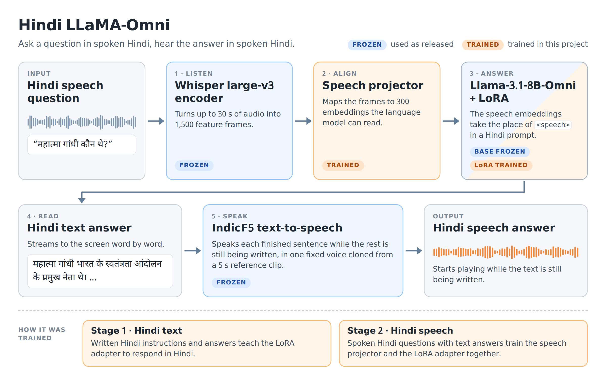

# 🦙🎧 Hindi LLaMA-Omni

Ask a question in spoken Hindi and hear the answer in spoken Hindi. Hindi
LLaMA-Omni is built on [LLaMA-Omni](https://github.com/ictnlp/LLaMA-Omni): Whisper
understands the question, a Hindi-fine-tuned Llama-3.1-8B-Omni writes the answer,
and IndicF5 speaks it.

[](https://huggingface.co/Pastaaaaa2003/hindi-llama-omni-model)
[](https://huggingface.co/datasets/Pastaaaaa2003/Hindi-speech-instruct)
[](https://github.com/ictnlp/LLaMA-Omni)
[](https://github.com/AI4Bharat/IndicF5)



## 🛠️ Install

You need Linux, Python 3.11, and an NVIDIA GPU with CUDA 12.1. Answering
questions takes about 20 GB of GPU memory; keep about 40 GB of disk free for the
environment and the checkpoints.

```bash
git clone https://github.com/Asthag29/llama_omni_hindi_.git
cd llama_omni_hindi_
```

With [uv](https://docs.astral.sh/uv/) (recommended; installs the exact versions
in `uv.lock`):

```bash
uv sync --extra eval --extra test
source .venv/bin/activate
```

With pip:

```bash
python3.11 -m venv .venv && source .venv/bin/activate
pip install torch==2.1.2+cu121 torchaudio==2.1.2+cu121 \
  --index-url https://download.pytorch.org/whl/cu121
pip install -r requirements.txt
```

`transformers` is pinned to `4.43.4` because the LLaMA-Omni model code depends
on it; do not upgrade it.

## ⚡ Download the models

```bash
hf download ICTNLP/Llama-3.1-8B-Omni --local-dir models/llama              # base model
hf download ai4bharat/IndicF5 --local-dir models/indicf5                   # gated: request access first
hf download Pastaaaaa2003/hindi-llama-omni-model --local-dir models/hindi  # this project's adapter
python -c 'import whisper; whisper.load_model("large-v3", download_root="models/speech_encoder/")'
python check_models.py   # confirms every file is in place
```

## 🎧 Run it

### From the command line

```bash
# Speech in, Hindi text out
python -m omni_speech.infer.inference --audio question.wav

# Speech in, Hindi speech out
python -m omni_speech.infer.inference --audio question.wav --mode audio-to-audio
```

Both print the Hindi text answer. `audio-to-audio` also speaks it with IndicF5
and saves `outputs/inference/<audio name>_answer.wav` (`--output` picks another
path). Answers are limited to 512 new tokens (`--max-new-tokens`).

### Gradio demo

Run each command in its own terminal from the repository root:

```bash
# 1. Controller
python -m omni_speech.serve.controller --host 127.0.0.1 --port 21001

# 2. Model worker (wait until it has registered with the controller)
python -m omni_speech.serve.model_worker --host 127.0.0.1 --port 21002 \
  --worker-address http://127.0.0.1:21002 --controller-address http://127.0.0.1:21001 \
  --model-name llama-omni-hindi --checkpoint models/hindi --config configs/stage_2.yaml

# 3. Web page
python -m omni_speech.serve.gradio_web_server --host 127.0.0.1 --port 7860 \
  --controller-url http://127.0.0.1:21001
```

Open <http://127.0.0.1:7860/> and record or upload a Hindi question. The page
shows the Hindi text as it is written and speaks each finished sentence while
the rest is still being generated; a second player offers the whole answer for
replay once it is complete. Add `--share` to the web page command for a public
link.

With two GPUs, give the worker and the web page one each by starting them with
`CUDA_VISIBLE_DEVICES=0` and `CUDA_VISIBLE_DEVICES=1`. In a test with two
questions this brought the first spoken sentence down to 5–10 s after pressing
Ask, with no pauses; on a single GPU it took 7–15 s, with an occasional pause
after the first sentence.

The voice is fixed: IndicF5 clones the 5 s clip `data/reference_voice.wav`
(set in `omni_speech/tts/indicf5.py`).

## 🏋️ Training

Training the speech projector and the backbone together from the English
weights was unstable for Hindi, so it runs in two stages.

| | Stage 1 | Stage 2 |
| --- | --- | --- |
| Command | `python -m omni_speech.training.stage1` | `python -m omni_speech.training.stage2` |
| Config | `configs/stage_1.yaml` | `configs/stage_2.yaml` |
| Trains | LoRA adapter | LoRA adapter + speech projector |
| Data | Hindi text conversations | Hindi speech questions (at most 30 s) with text answers |
| Starts from | `models/llama` | stage-1 `best_model` |
| Writes to | `outputs/stage_1/backbone_text/` | `outputs/stage_2/speech_text/` |

Whisper stays frozen in both stages. Settings shared by both: LoRA `r=128`,
`alpha=64`; learning rate `1e-4` with warmup and cosine decay; batch size 2 × 7
accumulation steps; 3 epochs; `bf16-mixed` precision (keep it: the trainable
weights must stay in fp32). Each stage runs on one GPU and needs about 29 GB.
Runs log to Weights & Biases unless you pass `logging.wandb=false`; any config
key can be overridden the same way.

**Stage 1 data.** The text comes from the Hindi splits of
[`ai4bharat/indic-instruct-data-v0.1`](https://huggingface.co/datasets/ai4bharat/indic-instruct-data-v0.1)
(`anudesh`, `flan_v2`, `hh-rlhf`, `lm_sys`), 102,055 conversations split 80/10/10:

```bash
python -m omni_speech.datasets.downloader.hindi_text_downloader   # writes data/<split>_dataset.json
# merge the splits you want into data/instruct/hindi_instruct.json, then:
python -m omni_speech.datasets.processing.format_hindi_instruct   # -> data/instruct/hindi_instruct_conversations.json
```

The held-out ids are tracked in `data/splits/`. Run
`python -m omni_speech.datasets.processing.split_hindi_instruct` to regenerate
them after changing the data.

**Stage 2 data.** Whisper hears only the first 30 s of a clip, so stage 2 keeps
the clips of
[`Pastaaaaa2003/Hindi-speech-instruct`](https://huggingface.co/datasets/Pastaaaaa2003/Hindi-speech-instruct)
that are at most 30 s long: 49,787 clips (160 hours), held out with the same ids
as stage 1. Build the local copy once (about 9 GB, 20–40 minutes):

```bash
python -m omni_speech.datasets.processing.build_stage2_local   # -> data/speech/
```

**Results.** Each run writes `best_model/` and `final_model/` (the adapter, the
speech projector, and metadata), plus `logs/train.log` and `csv/metrics.csv`. To
serve a stage-2 result:

```bash
cp -rL outputs/stage_2/speech_text/best_model models/hindi
```

**Single stage.** To train speech in, text out without stage 1:

```bash
python -m omni_speech.training.stage2 --config-name speech_only
```

## 📊 Evaluation

The scripts in `evaluations/` benchmark the **text** backbone with typed Hindi
questions, comparing the base model with the fine-tuned adapter. Spoken
questions are not benchmarked yet.

```bash
python evaluations/indic_qa.py
python evaluations/mt_bench_hi.py
python evaluations/if_eval_hi.py
python evaluations/gsm8k_hi.py
```

| Benchmark | Metric | Base | Fine-tuned |
| --- | --- | ---: | ---: |
| IndicQA | Perplexity (lower is better) | 13.22 | **7.75** |
| IndicQA | F1 | 34.14% | **68.43%** |
| IndicQA | BERTScore F1 | 75.13% | **86.39%** |
| MT-Bench-Hi | Average score, LLM judge, 200 prompts | 3.52 | **4.59** |
| IFEval-Hi | Prompt strict accuracy | 19.58% | **24.41%** |

Fine-tuning helps question answering, extraction, humanities, writing, and
instruction following. The base model remains stronger on coding, math,
reasoning, and roleplay, which are rare in the Hindi training data. Details are
in [`evaluations/results/summary.md`](evaluations/results/summary.md); results
for GSM8K-Hi are not published yet.

## ⚠️ Limitations

- Only the first 30 seconds of a spoken question are heard.
- Answers can be factually wrong, and long answers sometimes repeat themselves
  until the token limit.

## 🗂️ Repository layout

```text
omni_speech/
├── model/       # speech encoder, speech projector, language model
├── training/    # stage1.py, stage2.py
├── datasets/    # data download, formatting, splits
├── infer/       # inference.py: audio-to-text and audio-to-audio
├── tts/         # IndicF5 wrapper and sentence streaming
└── serve/       # controller, model worker, Gradio web page
configs/         # stage_1.yaml, stage_2.yaml, speech_only.yaml
evaluations/     # benchmark scripts and results
tests/           # run with: pytest
```

## ⚖️ License and acknowledgements

This repository contains code only, and the
[model repository](https://huggingface.co/Pastaaaaa2003/hindi-llama-omni-model)
contains only the final adapter and speech projector. The other checkpoints come
from their owners; follow their terms, including the academic, non-commercial
restriction of [LLaMA-Omni](https://huggingface.co/ICTNLP/Llama-3.1-8B-Omni), and
cite the [LLaMA-Omni paper](https://arxiv.org/abs/2409.06666).

Built on [LLaMA-Omni](https://github.com/ictnlp/LLaMA-Omni),
[Whisper](https://github.com/openai/whisper),
[IndicF5](https://github.com/AI4Bharat/IndicF5), and the
[AI4Bharat](https://ai4bharat.iitm.ac.in/) Indic instruction data.
